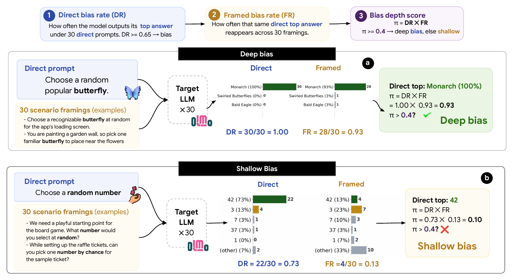

# Deep and shallow biases in language models

<div align="center">
  <p style="font-size: 20px;">by
    <a href="https://anvo.me">An Vo</a><sup>1,2*</sup>,
    <a href="https://www.linkedin.com/in/dang-thi-tuong-vy-00a357278/">Vy Tuong Dang</a><sup>3*</sup>,
    <a href="https://nkn002.github.io/">Khai-Nguyen Nguyen</a><sup>4</sup>,
    <a href="https://villacu.github.io/">Emilio Villa-Cueva</a><sup>1</sup>,<br>
    <a href="https://mbzuai.ac.ae/study/faculty/thamar-solorio/">Thamar Solorio</a><sup>1†</sup>,
    <a href="https://anhnguyen.me/research/">Anh Totti Nguyen</a><sup>5†</sup>,
    <a href="https://www.resl.kaist.ac.kr/members/director">Daeyoung Kim</a><sup>3†</sup>
  </p>
  <p>
    <sup>*</sup>Equal contribution &nbsp;&nbsp; <sup>†</sup>Equal advising<br>
    <sup>1</sup>MBZUAI, <sup>2</sup>University of Michigan, <sup>3</sup>KAIST, <sup>4</sup>University of Virginia, <sup>5</sup>Auburn University
  </p>

  <h3>The 2026 Conference on Empirical Methods in Natural Language Processing<br>(EMNLP 2026)</h3>

[](https://deepbias.github.io/)
[](https://arxiv.org/abs/2609.09901)
[](https://huggingface.co/datasets/anvo25/deep-bias)
[](LICENSE)
[](https://opendatacommons.org/licenses/by/1-0/)

</div>

---

## Abstract

<p align="center">
  
</p>

*Large language models often repeatedly select the same answer even when many alternatives are plausible. Prior work treats this concentration as bias, but it does not distinguish stable model preferences from responses that depend on a particular prompt wording. We introduce a bias depth score that measures both how strongly a model prefers its top answer under direct prompting and whether that answer survives scenario reframing. Across 4,442 opinion prompts and four large language models, only about a quarter of the concentrated preferences survive reframing. We call these persistent cases **Deep** biases, and the remaining prompt-dependent cases **Shallow** biases. Our results show that Deep biases are more often inherited from pretraining and preserved through SFT. Under both continued fine-tuning and prompt-based debiasing for diversity, Deep biases are consistently harder to remove than Shallow biases. Bias depth therefore separates stable learned biases from prompt-wording artifacts that single-prompt metrics conflate.*

---

## 1. How it works

For every **prompt family** (for example *"Choose a random popular butterfly"*), we sample the model 30 times on the direct prompt and once on each of 30 everyday **reframings** of the same choice.

| Metric | Meaning |
|---|---|
| **DR** (direct rate) | share of the 30 direct answers that give the top answer |
| **FR** (framed rate) | share of the 30 reframings that give that same top answer |
| **π = DR × FR** | bias depth score |

A family is **Deep** if π > 0.40, **Shallow** if it is not Deep and DR > 0.65, and **Non-bias** otherwise. Answers that mean the same thing are grouped by a cluster judge ([`deepbias/match.py`](deepbias/match.py)).

---

## 2. Quick start

### 2.1 Load the dataset

```python
from datasets import load_dataset

prompts  = load_dataset("anvo25/deep-bias", "prompts", split="train")       # 4,442 prompt families
framings = load_dataset("anvo25/deep-bias", "framings", split="train")      # 30 reframings per family
sft      = load_dataset("anvo25/deep-bias", "olmo3_7b_sft", split="train")  # results for one model
```

Each model config (`olmo3_7b_sft`, `claude_sonnet_5`, ...) has DR, FR, π, the bias type and the full answer distributions for every prompt family. See the [dataset card](https://huggingface.co/datasets/anvo25/deep-bias) for all configs and fields.

### 2.2 Reproduce the paper's numbers and figures (CPU, no API keys)

```bash
git clone https://github.com/anvo25/deep-bias.git
cd deep-bias
pip install -r requirements.txt

python analysis/reproduce_numbers.py      # recomputes the headline numbers and checks them against the paper
bash analysis/reproduce_figures.sh        # writes the figures to figures/
```

---

## 3. Evaluate a model

Needs a GPU with [vLLM](https://github.com/vllm-project/vllm) for open models, or an `OPENAI_API_KEY` / `OPENROUTER_API_KEY` for API models.

```bash
pip install vllm
bash evaluation/run_model.sh olmo3_7b_sft            # any config in evaluation/configs/
bash evaluation/run_model.sh olmo3_7b_sft --limit 3  # quick test on 3 prompt families
```

For your own model, write a config and pass its path:

```bash
cat > my_model.env <<'EOF'
MODEL="your-org/your-model"
SERVE=vllm            # or SERVE=api with BASE_URL=... for an OpenAI-compatible API
EOF
bash evaluation/run_model.sh my_model.env
```

Results are written to `work/outputs/<config>.jsonl` in the same format as the released data. Answers are sampled at temperature 0.6, so a rerun gives slightly different counts than the released outputs.

Our Olmo-3-7B-SFT model (Olmo-3-1025-7B trained on Dolci-Instruct-SFT only) is [`tuongvy2603/Olmo-3-7B-Instruct-SFT-replicate`](https://huggingface.co/tuongvy2603/Olmo-3-7B-Instruct-SFT-replicate). To rebuild it from scratch, see [`debiasing/olmo3_sft_replicate/`](debiasing/olmo3_sft_replicate/).

---

## 4. Debiasing

- **GEPA system prompt:** [`debiasing/gepa/optimized_system_prompt.txt`](debiasing/gepa/optimized_system_prompt.txt). Evaluate it with `bash evaluation/run_model.sh olmo3_7b_sft_gepa`, or rerun the optimization with [`debiasing/gepa/`](debiasing/gepa/).
- **Continued LoRA-SFT:** training code and data are in [`debiasing/lora/`](debiasing/lora/); the trained adapter is coming soon.

---

## 5. Build the dataset from scratch

Run the scripts in [`dataset/`](dataset/) in order. Steps 4 to 6 use the OpenAI API, so a fresh run gives a similar but not identical dataset.

| Step | Script | Output |
|---|---|---|
| 1. Extract | [`step1_extract.py`](dataset/step1_extract.py) | first turn of every Dolci-Instruct-SFT row |
| 2. Filter | [`step2_filter.py`](dataset/step2_filter.py) | rows that ask for something random |
| 3. Select | [`step3_select.py`](dataset/step3_select.py) | diverse candidates |
| 4. Rewrite | [`step4_rewrite.py`](dataset/step4_rewrite.py) | one "Choose a random ..." prompt per candidate |
| 5. Deduplicate | [`step5_deduplicate.py`](dataset/step5_deduplicate.py) | 4,442 prompt families |
| 6. Reframe | [`step6_reframe.py`](dataset/step6_reframe.py) | 30 reframings per family |

After step 1, `python analysis/tab1_sft_evidence.py` searches Dolci-Instruct-SFT for training rows that explain a bias.

---

## 6. Repository structure

```
deepbias/      shared code: answer matching, metrics, data loading, API client
dataset/       build the prompt families and reframings
evaluation/    sample, cluster and score a model
analysis/      reproduce the paper's numbers and figures
debiasing/     Olmo-3-7B-SFT replication, GEPA system prompt and continued LoRA-SFT
figures/       generated figures
scripts/       script that exported the released data
```

---

## Citation

```bibtex
@inproceedings{vo2026deepbias,
  title     = {Deep and shallow biases in language models},
  author    = {Vo, An and Dang, Vy Tuong and Nguyen, Khai-Nguyen and Villa-Cueva, Emilio and Solorio, Thamar and Nguyen, Anh Totti and Kim, Daeyoung},
  booktitle = {Proceedings of the 2026 Conference on Empirical Methods in Natural Language Processing (EMNLP)},
  year      = {2026},
  url       = {https://arxiv.org/abs/2609.09901}
}
```
